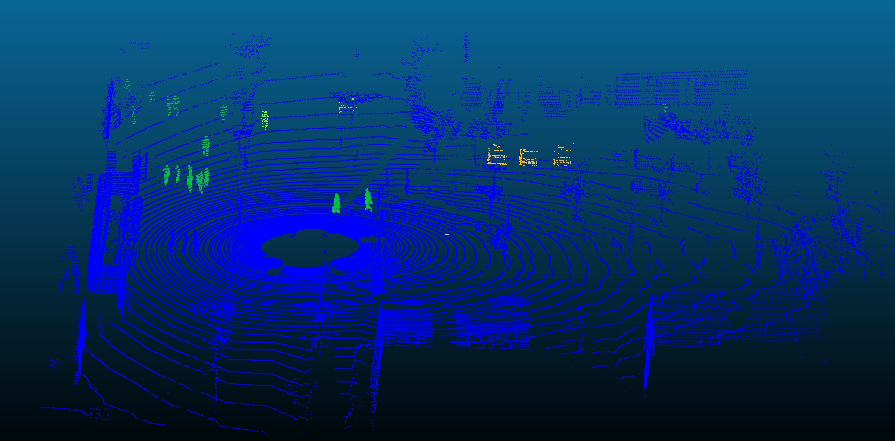

# KITTI point cloud label tool

## Introduction

This tool could annotate the KITTI Velodyne point cloud with the label.
I found there is no such tool could do this.
It's simple but I prefer there is some code available directly.

Time:

    Trainig: Using 8 CPU core may take around whole night.   
    Testing: Using 8 CPU core may take around 30min.


If you have any questions, please let me know.

Some of the code is from: https://github.com/barrykui/kitti_object_vis



## Dataset

Download the data (calib, label\_2, velodyne) from [Kitti Object Detection Dataset](http://www.cvlibs.net/datasets/kitti/eval_object.php?obj_benchmark=3d)

The folder structure is as following (you don't need to remove other folder, just make sure those folder exist):
```
training
    calib
    label_2
    velodyne
testing
    velodyne
```
Requirements
```
pip install laspy
pip install numpy
pip install pymp-pypi
```
Run
```
##Explaination
python label_kitti_point_cloud.py /input_folder/ /output_folder/ valid_distance has_label num_thread

##Example
####for training set
python kitti_label.py /volumes1/KITTI/training/ /volumes1/KITTI/las/ 50 True 8
####for testing set
python kitti_label.py /volumes1/KITTI/testing/ /volumes1/KITTI/las/ 50 False 8
```
